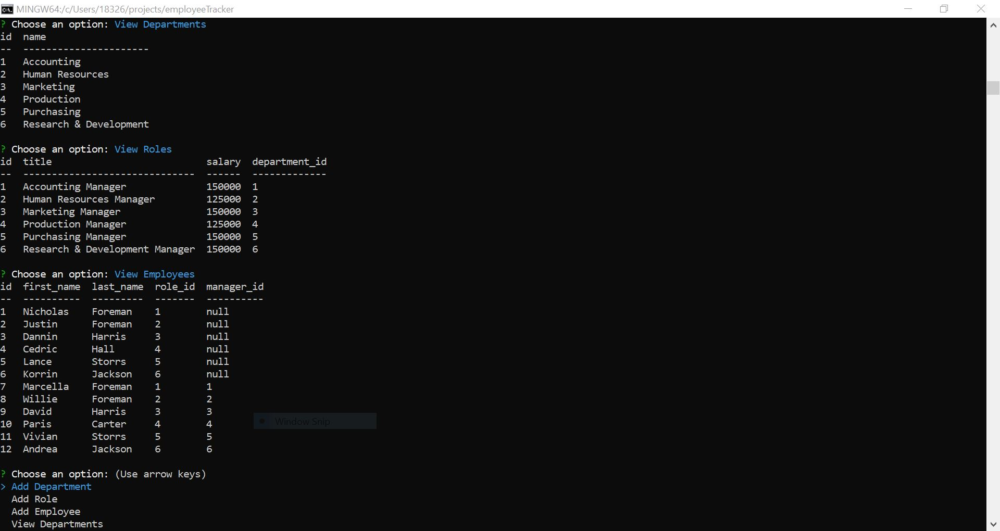

# Employee Tracker
Unit 12 - MySQL

## Description

This is an interface that allows non-developers to view and interact with information stored in databases.

This application builds a solution for managing a company's employees using node, inquirer, and MySQL.

## Table of Contents

- [Installation](#Installation)
- [Usage](#Usage)
- [License](#License)
- [Contribution](#Contribution)
- [Testing](#Testing)
- [Questions](#Questions)

## Installation

- NPM Install
- Inquirer
- MySQL

### app.js

This is the Javascript file that runs the appication. This file also contains the different functions needed to run the application successfully.

- Displaying the Tracker: displayTracker()
- Adding a Department: addDepartment()
- Adding a Role: addRole()
- Adding an Employee: addEmployee()
- Viewing All Department: viewDepartment()
- Viewing All Department: viewDepartment()
- Viewing All Department: viewDepartment()
- Updating an Employee's Role: updateEmployeeRole()

### employeeTracker-Schema.sql

This file contains the database (employeeTracker), along with the different tables needed for the application:

- "Department" Table
- "Role" Table
- "Employee" Table

### seed.sql

This folder contains the data that you input into the different tables.

### Additional Files

- package.json
- package-lock.json
- "node_modules" Folder

## Usage

## License

MIT License

Copyright (c) [2020] [Nicholas Foreman]

Permission is hereby granted, free of charge, to any person obtaining a copy
of this software and associated documentation files (the "Software"), to deal
in the Software without restriction, including without limitation the rights
to use, copy, modify, merge, publish, distribute, sublicense, and/or sell
copies of the Software, and to permit persons to whom the Software is
furnished to do so, subject to the following conditions:

The above copyright notice and this permission notice shall be included in all
copies or substantial portions of the Software.

THE SOFTWARE IS PROVIDED "AS IS", WITHOUT WARRANTY OF ANY KIND, EXPRESS OR
IMPLIED, INCLUDING BUT NOT LIMITED TO THE WARRANTIES OF MERCHANTABILITY,
FITNESS FOR A PARTICULAR PURPOSE AND NONINFRINGEMENT. IN NO EVENT SHALL THE
AUTHORS OR COPYRIGHT HOLDERS BE LIABLE FOR ANY CLAIM, DAMAGES OR OTHER
LIABILITY, WHETHER IN AN ACTION OF CONTRACT, TORT OR OTHERWISE, ARISING FROM,
OUT OF OR IN CONNECTION WITH THE SOFTWARE OR THE USE OR OTHER DEALINGS IN THE
SOFTWARE.

(https://img.shields.io/badge/license-MIT-blue.svg)

## Contribution

N/A

## Testing

NPM Test

## Questions

If you have any additional questions, feel free to contact me via email:
nicholas.m.foreman@gmail.com

* ![GitHub license] (https://img.shields.io/badge/license-MIT-blue.svg)